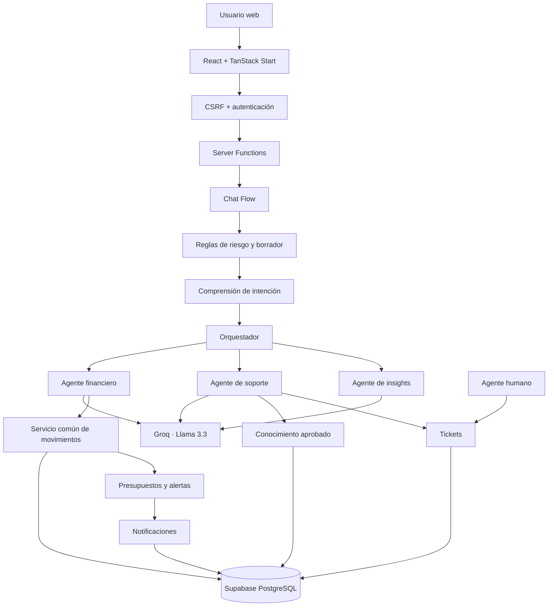

# Kintu Finance AI

Kintu es un asistente financiero conversacional desarrollado para el **Track 2: Interfaces inteligentes para finanzas personales y canales masivos**. El prototipo permite registrar ingresos y gastos en lenguaje natural, administrar movimientos y presupuestos, recibir notificaciones y escalar casos sensibles a revisión humana.

> Estado del prototipo: funcional de extremo a extremo con datos ficticios o de prueba. No ejecuta operaciones bancarias, bursátiles ni regulatorias reales.

## Qué resuelve

### 1. Registro y análisis conversacional inteligente

El usuario puede interactuar de forma natural para registrar o consultar información financiera:

- **Registro de movimientos:** Frases naturales como _"Ayer gasté 45 dólares en comida"_ o _"Me pagaron 120 por un trabajo"_.
- **Correcciones y cancelaciones:** _"No fueron 30, fueron 25"_.
- **Memoria de contexto conversacional:** Reconoce preguntas de seguimiento e incompletas basadas en pronombres o elipsis (ej. _"¿y en cuál?"_, _"¿pero en qué?"_, _"¿cuál fue la mayor?"_, _"¿y la segunda?"_).
- **Análisis de ingresos y gastos por categoría:** Responde a consultas específicas sobre desgloses y rankings (ej. _"¿En qué tengo más ingresos?"_ o _"¿Cuál es mi mayor gasto?"_) mostrando desgloses reales sin respuestas genéricas repetitivas, ordenando clasificaciones en rankings descendentes, y con respuestas inteligentes si no hay datos o si existe una sola categoría.

La transacción solo se guarda después de una confirmación explícita:

```text
NEEDS_INFO → AWAITING_CONFIRMATION → SAVED
                         ↘ CANCELLED
```

La confirmación es idempotente: un mismo borrador no puede originar dos transacciones, incluso ante doble clic o reintentos concurrentes.

### 2. Mis movimientos

El usuario dispone de una tabla para:

- crear, editar y eliminar movimientos;
- filtrar y ordenar registros;
- importar archivos Excel, XLS o CSV;
- revisar una vista previa antes de importar;
- omitir filas inválidas y detectar duplicados;
- descargar una plantilla;
- exportar los resultados filtrados a Excel.

Solo los movimientos con estado `confirmed` afectan balance, dashboard y presupuestos. Los movimientos `pending` permanecen visibles, pero no se consideran dinero real.

### 3. Presupuestos, alertas y notificaciones

El usuario puede definir un límite mensual por categoría y un umbral configurable. Los cálculos de consumo, estado y cruce de umbral se realizan con código determinista.

Las notificaciones informan eventos financieros y cambios de tickets. Una clave de evento evita avisos repetidos para el mismo hecho.

### 4. Insights personalizados

Kintu compara movimientos confirmados, presupuestos y periodos mensuales para detectar patrones como:

- balance positivo o negativo;
- aumento o reducción de gastos;
- categoría con mayor consumo;
- presupuesto próximo al límite o excedido;
- categorías relevantes sin presupuesto.

El código calcula los datos. El modelo únicamente ayuda a seleccionar y redactar las observaciones más relevantes.

### 5. Soporte con conocimiento aprobado

Las respuestas institucionales se generan únicamente a partir de artículos aprobados en Supabase. Si la información no existe, Kintu evita inventarla y ofrece escalar el caso.

Los reclamos, cargos desconocidos, operaciones sensibles y temas regulatorios crean un ticket con prioridad, contexto estructurado e historial de conversación. Un usuario con rol `agent` o `admin` puede tomar, revisar, resolver o reabrir casos.

## Arquitectura



Los detalles se encuentran en [`docs/ARQUITECTURA.md`](docs/ARQUITECTURA.md).

## Principios de seguridad y confiabilidad

- **Human-in-the-loop:** ninguna operación sensible se ejecuta automáticamente.
- **Confirmación antes de escribir:** los movimientos conversacionales permanecen como borradores hasta que el usuario confirme.
- **Idempotencia:** `origin_draft_id` evita transacciones duplicadas.
- **CSRF:** las Server Functions están protegidas por middleware de mismo origen.
- **RLS:** Supabase separa los datos por usuario; agentes y administradores reciben permisos específicos.
- **Respuestas fundamentadas:** soporte usa únicamente artículos con `approved = true`.
- **Validación estructurada:** los objetos de IA se validan con Zod.
- **Cálculos deterministas:** balances, presupuestos, alertas e insights numéricos no dependen del modelo.
- **Estado financiero explícito:** solo `confirmed` afecta saldos; `pending` no se contabiliza.
- **Minimización de secretos:** las claves privadas permanecen únicamente en el servidor.

## Tecnologías

- TanStack Start
- React 19 y TypeScript
- Vite y Nitro
- Supabase Auth, PostgreSQL y Row Level Security
- Vercel AI SDK
- Groq con `llama-3.3-70b-versatile`
- Zod
- Tailwind CSS y componentes Radix
- SheetJS (`xlsx`) cargado bajo demanda
- Vitest

## Requisitos

- Node.js 20 o superior
- npm
- Proyecto Supabase con las migraciones aplicadas
- Clave de Groq

## Instalación local

```bash
npm ci
cp .env.example .env
```

Completar `.env`:

```env
SUPABASE_URL=
SUPABASE_PUBLISHABLE_KEY=
SUPABASE_SERVICE_ROLE_KEY=
VITE_SUPABASE_URL=
VITE_SUPABASE_PUBLISHABLE_KEY=
GROQ_API_KEY=
AI_MODEL=llama-3.3-70b-versatile
```

Aplicar en orden las migraciones de `supabase/migrations/` y luego iniciar:

```bash
npm start
```

## Comandos de calidad

```bash
npm run lint
npm run typecheck
npm test
npm run build
```

Validación integral:

```bash
npm run verify
```

Estado validado:

```text
TypeScript: correcto
Pruebas: 169 aprobadas en 25 archivos
Build cliente, SSR y Nitro: correcto
Lint: sin errores
```

## Rendimiento

La librería `xlsx` se carga dinámicamente únicamente cuando el usuario descarga una plantilla, importa o exporta movimientos. Esto redujo el paquete inicial del módulo de movimientos de aproximadamente 497 kB a 76 kB; la librería queda en un chunk separado bajo demanda.

El aviso de `vite-tsconfig-paths` durante desarrollo proviene del wrapper `@lovable.dev/vite-tanstack-config`, que todavía registra ese plugin como dependencia interna. No afecta pruebas, build ni ejecución.

## Demostración recomendada

1. Iniciar sesión como cliente.
2. Registrar un ingreso con lenguaje natural.
3. Registrar un gasto, corregir un dato y confirmar.
4. Ver el registro en **Mis movimientos** y el dashboard.
5. Mostrar presupuesto, progreso y notificación.
6. Importar una plantilla con una fila válida y una duplicada.
7. Solicitar un insight financiero.
8. Preguntar algo institucional y mostrar la fuente aprobada.
9. Reportar un cargo desconocido.
10. Abrir la bandeja con una cuenta `agent`, resolver el caso y mostrar la notificación al cliente.

Guion detallado: [`docs/GUION_VIDEO_3_MIN.md`](docs/GUION_VIDEO_3_MIN.md).

## Integración empresarial

Kintu está diseñado como módulo de experiencia digital para bancos, cooperativas, fintechs o casas de valores. En el prototipo:

- el canal activo es web con experiencia de mensajería;
- Supabase simula el backend transaccional y de soporte;
- la base aprobada representa procedimientos institucionales;
- la bandeja de tickets representa la integración con atención al cliente;
- el orquestador puede conservarse al sustituir los adaptadores por APIs empresariales o WhatsApp Business.

## Alcance y limitaciones

Implementado:

- chat web autenticado;
- registro de ingresos y gastos;
- comprensión de intención, negación, futuro, hipótesis y correcciones;
- memoria conversacional de borradores;
- confirmación y cancelación;
- CRUD e importación/exportación de movimientos;
- presupuestos, alertas y notificaciones;
- dashboard con series reales;
- insights personalizados basados en datos confirmados;
- soporte fundamentado;
- tickets y bandeja humana;
- 109 pruebas automatizadas.

No implementado:

- conexión real con cuentas bancarias;
- webhook real de WhatsApp;
- compra o venta de inversiones;
- transferencias, retiros o bloqueos reales;
- recomendaciones personalizadas de inversión.

## Documentación

- [Documento explicativo](docs/DOCUMENTO_EXPLICATIVO.md)
- [Arquitectura técnica](docs/ARQUITECTURA.md)
- [Pruebas manuales](docs/PRUEBAS_DEMO.md)
- [Guion del video](docs/GUION_VIDEO_3_MIN.md)
- [Checklist de entrega](docs/CHECKLIST_ENTREGA.md)

## Equipo

Proyecto desarrollado por el equipo **Kintu Finance AI** para Ecuador Tech Week / Agentic Scale Hackathon.
