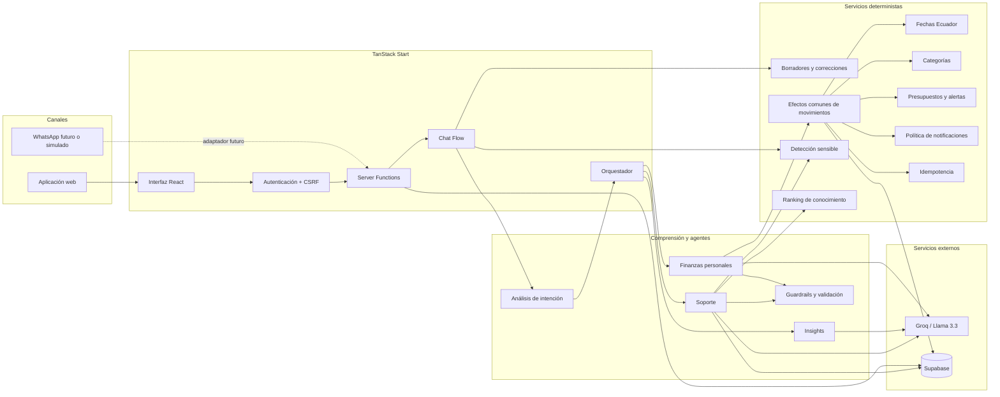
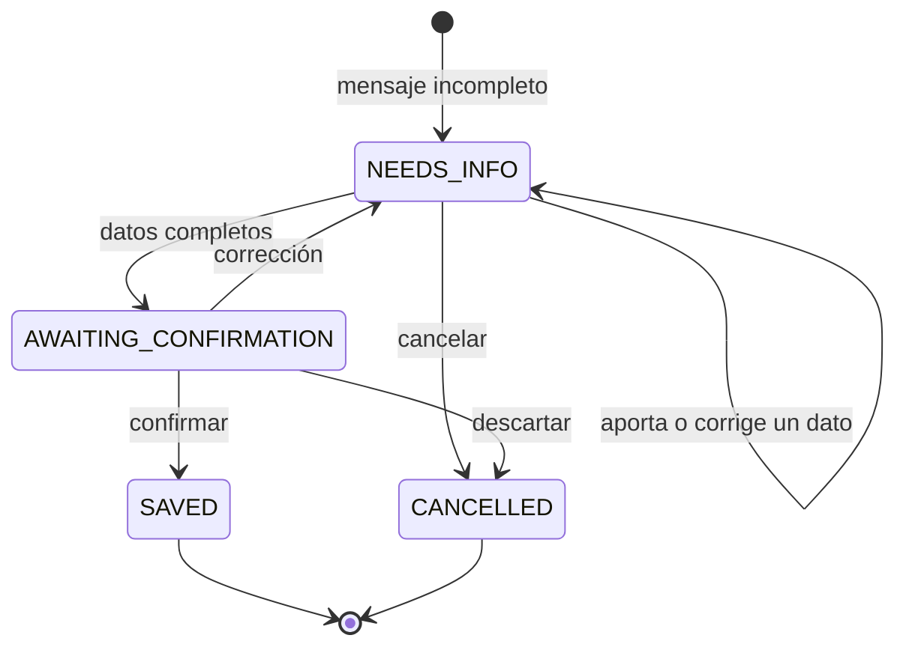
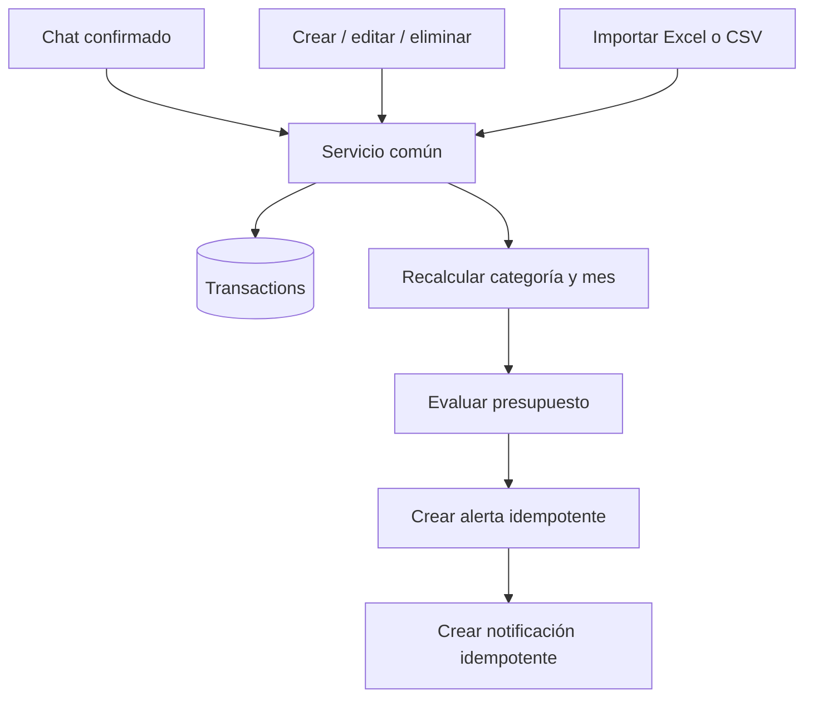
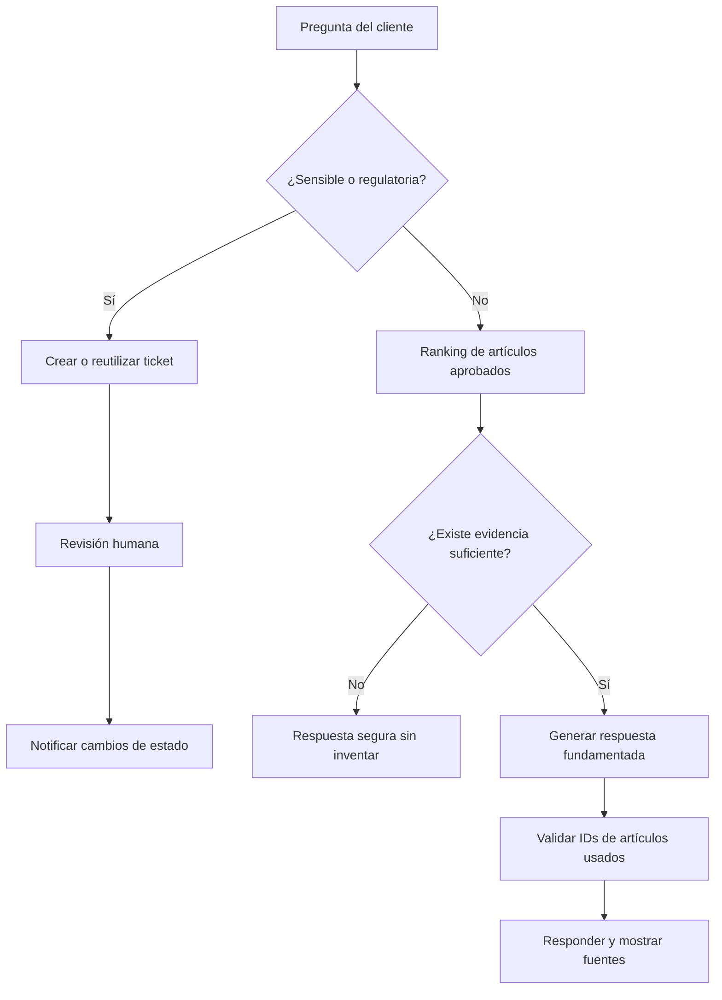

# Arquitectura técnica de Kintu Finance AI

## Vista general

Kintu separa comprensión de lenguaje, reglas financieras, persistencia y revisión humana. El modelo interpreta mensajes y redacta respuestas, pero no escribe movimientos directamente ni realiza cálculos monetarios.



## Comprensión del mensaje

```text
mensaje
→ recuperar historial de la conversación
→ riesgo o reclamo prioritario
→ borrador activo
→ intención y función lingüística (considerando historial para preguntas de seguimiento)
→ negación / futuro / hipótesis / corrección
→ extracción de campos
→ validación determinista
→ actuar, confirmar o pedir aclaración
```

La capa de comprensión devuelve datos estructurados como intención, tipo de transacción, si ocurrió, indicadores lingüísticos y nivel de confianza. Para preguntas de seguimiento cortas o elipsis (ej. _"¿y la segunda?"_), se utiliza el historial reciente para inferir correctamente la intención final. El código conserva la decisión final.

## Flujo de transacción conversacional



### Controles importantes

1. `message-understanding.ts` identifica intención y señales lingüísticas.
2. `expense-flow.ts` interpreta y normaliza el movimiento.
3. `expense-correction.ts` modifica un borrador sin crear otro flujo.
4. `transaction-drafts.server.ts` conserva el estado en Supabase.
5. `saveConfirmedTransaction()` recupera los datos desde el servidor.
6. `origin_draft_id` tiene un índice único para impedir duplicados.
7. `movement-effects.server.ts` aplica la misma lógica a chat, CRUD e importación.
8. Solo movimientos `confirmed` afectan balance y presupuesto.

## Flujo común de movimientos



## Flujo de soporte



## Componentes principales

| Componente                     | Responsabilidad                                                                                    |
| ------------------------------ | -------------------------------------------------------------------------------------------------- |
| `chat-flow.server.ts`          | Priorizar borradores, riesgo e interrupciones                                                      |
| `message-understanding.ts`     | Intención, realidad, negación, futuro e hipótesis                                                  |
| `orchestrator.ts`              | Dirigir transacciones, presupuestos, soporte e insights                                            |
| `expense-flow.ts`              | Extraer y completar movimientos                                                                    |
| `expense-correction.ts`        | Corregir borradores activos                                                                        |
| `transaction-drafts.server.ts` | Persistir estados conversacionales                                                                 |
| `movement-effects.server.ts`   | Unificar efectos de chat, CRUD e importación                                                       |
| `budget.ts`                    | Calcular consumo, umbral y estado                                                                  |
| `notifications/policy.ts`      | Deduplicar y priorizar notificaciones                                                              |
| `insight-agent.server.ts`      | Cargar desgloses de ingresos/gastos por categorías y responder con LLM conversacional y contextual |
| `support-flow.server.ts`       | Responder desde KB o escalar                                                                       |
| `support-retrieval.ts`         | Ranking lexical y sinónimos                                                                        |
| `sensitivity.ts`               | Detectar fraude, reclamos y operaciones sensibles                                                  |
| `tickets.functions.ts`         | Flujo humano autorizado                                                                            |
| `structured.server.ts`         | Solicitar JSON y validarlo con Zod                                                                 |

## Modelo de datos relevante

- `transactions`
- `transaction_drafts`
- `budgets`
- `alerts`
- `notifications`
- `conversations`
- `messages`
- `knowledge_articles`
- `tickets`
- `user_roles`

Las operaciones de usuario se ejecutan con un cliente Supabase autenticado y políticas RLS. El cliente administrativo se limita a módulos de servidor explícitos.

## Seguridad

- middleware CSRF para Server Functions;
- autenticación por cookie y Supabase;
- RLS por usuario;
- claves privadas sin prefijo `VITE_`;
- límites de 1000 filas por importación;
- Zod para entradas y salidas estructuradas;
- confirmación humana antes de guardar;
- tickets para acciones sensibles.

## Despliegue

El build utiliza Nitro con preset `cloudflare-module`, configurado por `@lovable.dev/vite-tanstack-config`.

```bash
npm run verify
npx vite preview
```

La plataforma debe recibir las variables de `.env.example`. `GROQ_API_KEY` y `SUPABASE_SERVICE_ROLE_KEY` deben existir únicamente en el servidor.
