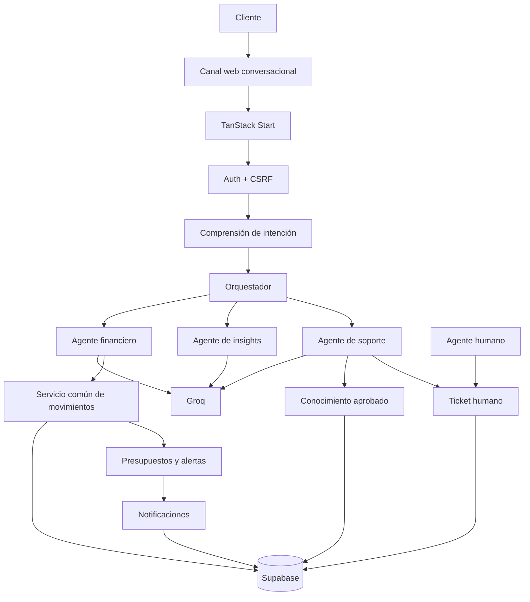

# Documento explicativo — Kintu Finance AI

## 1. Track asignado

**Track 2: Interfaces inteligentes para finanzas personales y canales masivos.**

## 2. Problema

Muchas personas no mantienen un registro constante de sus gastos porque las aplicaciones financieras suelen exigir formularios, categorías manuales y varios pasos. Al mismo tiempo, los clientes de entidades financieras necesitan respuestas rápidas, pero los casos sensibles no deben resolverse automáticamente ni con información inventada.

## 3. Solución propuesta

Kintu convierte una conversación cotidiana en un flujo financiero controlado. El usuario describe un ingreso o gasto con sus propias palabras; el sistema identifica intención y datos, reconoce negaciones o hipótesis, pregunta únicamente lo que falta y solicita confirmación antes de guardar.

La aplicación también ofrece CRUD e importación/exportación de movimientos, presupuestos, notificaciones, insights y soporte. Las respuestas institucionales se limitan a una base aprobada. Los reclamos y operaciones sensibles se escalan a un humano mediante tickets con contexto e historial.

## 4. Tipo de negocio

La solución se plantea como módulo digital de marca blanca para bancos, cooperativas de ahorro y crédito, fintechs, casas de valores y plataformas de bienestar financiero.

## 5. Historias de usuario cubiertas

### HU1 — Registro y análisis conversacional

- Comprensión de mensajes naturales y coloquiales para transacciones o consultas.
- Extracción de tipo, monto, fecha, categoría y comercio.
- Detección de negación, futuro, hipótesis, corrección y ambigüedad.
- Memoria contextual basada en el historial para resolver preguntas de seguimiento e incompletas (ej. _"¿y la segunda?"_).
- Desglose y análisis conversacional inteligente de ingresos y gastos por categoría (rankings descendentes, respuestas simplificadas ante única o cero categorías).
- Preguntas cuando falta información.
- Borrador persistente entre mensajes.
- Confirmación o cancelación.
- Escritura única e idempotente.
- Actualización de ingresos, gastos y balance con datos de prueba.

### HU2 — Presupuestos

- Límite mensual por categoría.
- Umbral configurable.
- Estados normal, advertencia y excedido.
- Alertas y notificaciones deterministas.
- Resumen de ingresos, gastos, balance y categorías principales.
- Insights basados únicamente en datos confirmados.
- Sin recomendaciones personalizadas de inversión.

### HU3 — Soporte

- Respuestas únicamente desde artículos aprobados.
- Fuentes visibles.
- Negativa segura cuando falta información.
- Detección de fraude, reclamos y operaciones sensibles.
- Ticket con prioridad, contexto e historial.
- Bandeja de revisión humana y resolución trazable.
- Notificación al cliente ante cambios relevantes.

## 6. Arquitectura

## 7. Integración con sistemas empresariales

El prototipo utiliza Supabase como backend de prueba. Para integrarse con una entidad existente se mantendría la capa agentic y se sustituirían adaptadores:

- transacciones: API bancaria o core financiero;
- identidad: SSO/OAuth institucional;
- conocimiento: gestor documental aprobado;
- soporte: CRM o mesa de servicio;
- canal: web, aplicación móvil, WhatsApp Business o herramienta low-code.

Las acciones regulatorias continuarían como alertas, propuestas o solicitudes de aprobación humana.

## 8. Controles contra alucinaciones y riesgo

- Zod valida entradas y salidas estructuradas.
- Soporte solo recibe artículos aprobados y recuperados por relevancia.
- Las citas se validan contra los artículos disponibles.
- El sistema no completa vacíos con supuestos.
- Los cálculos monetarios se realizan en TypeScript.
- Las transacciones requieren confirmación explícita.
- Una restricción única impide confirmaciones duplicadas.
- Negaciones, hipótesis y futuro no se tratan como hechos consumados.
- Los temas sensibles interrumpen un borrador sin contaminarlo.
- Ninguna acción bancaria o bursátil real se ejecuta.
- Las Server Functions están protegidas por CSRF.

## 9. Datos y privacidad

La demostración utiliza datos ficticios y cuentas de prueba. El prototipo no requiere credenciales bancarias ni acceso a cuentas reales. Supabase aplica Row Level Security para separar información por usuario.

## 10. Viabilidad comercial

Kintu reduce fricción en captura de movimientos, aumenta la interacción con presupuestos, ofrece alertas proactivas y filtra consultas de soporte antes de llegar a un humano. La arquitectura permite adoptarlo gradualmente: primero como asistente informativo y de registro, luego como capa conversacional integrada a sistemas empresariales.

## 11. Estado técnico

- TypeScript sin errores.
- Lint sin errores.
- 169 pruebas automatizadas aprobadas en 25 archivos.
- Build de cliente, SSR y Nitro correcto.
- Librería Excel separada del paquete inicial mediante carga dinámica.
- Flujo principal preparado para validación end-to-end tras aplicar migraciones.

## 12. Limitaciones del prototipo

- Canal real de WhatsApp no conectado; se demuestra mediante web conversacional.
- Sin integración bancaria real.
- Sin ejecución de transferencias, retiros o inversiones.
- Las notificaciones nuevas requieren aplicar las migraciones incluidas.
- Deduplificación de tickets basada en la coincidencia del caso activo y su contexto disponible.
